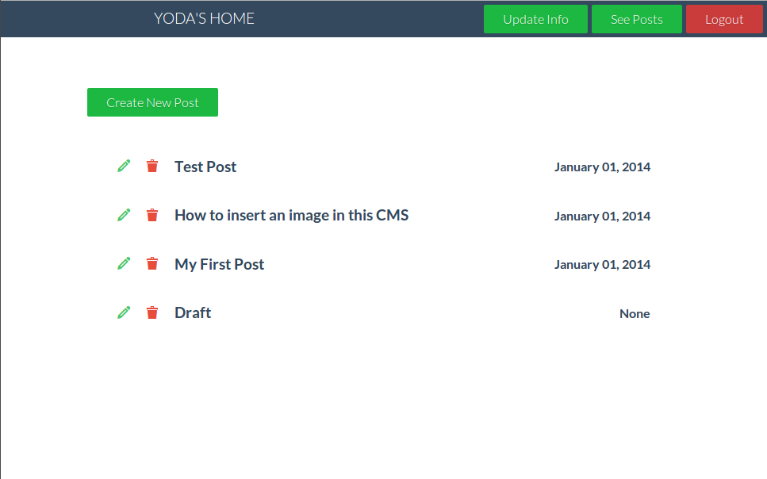

FlaskLogger
===========

Flask application for blogging using Markdown

I have become a hardcore flask fan since last 3 months. I have been looking around and around but I couldn't find any decent Flask based blogging application. I wanted to blog using Flask.

This is the result of my love for Flask and Markdown.

Features
--------

1. Admin interface.

2. Live Preview.

3. Customised headers


Installation
------------

1. Download the repository.
2. cd into the directory you want to install the Flask application in.
3. Unzip the repository there.
4. Fire up the terminal and type ```python virtualenv.py flask```
5. Once it is installed, fire the following commands.
```
flask/bin/pip install flask==0.9
flask/bin/pip install flask-login
flask/bin/pip install sqlalchemy==0.8.2
flask/bin/pip install flask-sqlalchemy==0.16
flask/bin/pip install sqlalchemy-migrate==0.8.2
flask/bin/pip install flask-wtf==0.8.4
flask/bin/pip install flask-misaka
```

6. Now do ```./run.py```

I have tried adding as many features as possible for a simple markdown based CMS. However, this still lacks custom styling. In future versions I might add that feature. I haven't done anything yet ith the twitter, facebook and website links. I am thinking of adding an about page or something of that kind.

This is my first big Flask application. So it might not be very stable or secure. If you happen to find any bad practices, please do let me know or make a pull request.

